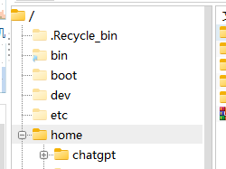

### 部署教程

1.将本目录放置在你linux 服务器的 /home/chatgpt 下面, 如图所示
推荐和我放置在同一目录



#### 服务器环境准备

准备好一台Linux服务器，安装好 Docker 和 Docker-Compose ，并且开放 80 和 443 端口


#### 准备工作

1.申请好域名和` ssl `证书, 并且做好域名解析
- 以下是推荐解析
- chat.example.com  解析到你的服务器ip 用于部署 chatgpt-web
- pt.example.com    解析到你的服务器ip 用于部署 portainer

2.把chatgpt-web 项目的证书和私钥放置在 `docker-compose\nginx\ssl` 目录下

3.把 Portainer 容器管理工具项目的证书和私钥放置在   `docker-compose\nginx\portainer_ssl` 目录下

注意：如果你的文件目录和我的位置不一样的情况你需要自行修改 docker-compose.yml -volumes 挂载的数据卷目录，如何和我的保持一致，你不需要修改，省很多事

```yml
 volumes:
      - ./nginx/html:/usr/share/nginx/html
      - ./nginx/nginx.conf:/etc/nginx/conf.d/default.conf
      - ./nginx/portainer.conf:/etc/nginx/conf.d/portainer.conf
      - ./nginx/cockpit.conf:/etc/nginx/conf.d/cockpit.conf
      - /home/chatgpt/docker-compose/nginx/ssl:/etc/nginx/ssl
      - /home/chatgpt/docker-compose/nginx/portainer_ssl:/etc/nginx/portainerSSL
    depends_on:
      - app
```


#### 修改配置文件

需要修改的文件，按准注释标识修改就行
```
docker-compose\nginx\nginx.conf
docker-compose\nginx\portainer.conf
```
- docker-compose\nginx\nginx.conf 是 chatGPT-WEB 项目的nginx 配置 
- docker-compose\nginx\portainer.conf 是 Portainer 项目的nginx 配置 

暂时没用上，不用管
```
docker-compose\nginx\cockpit.conf

```

#### 启动项目
当你一起准备就绪之后，直接 cd /home/chatgpt/docker-compose
注意： 一定要cd到 /home/chatgpt/docker-compose 目录才能运行 docker-compose up -d

```
docker-compose up -d
```

当你启动成功之后你需要打开浏览器输入 `pt.example.com` 进入到你的 Portainer 项目，然后按照提示设置账户名和密码，一定要快。他是有时间限制的，超时进不去的，超时了你只能重启容器 `docker-compose start`


#### Portainer是什么？

Portainer是一款免费且开源的容器管理工具，可以用来简化Docker容器的部署、管理和监控。Portainer提供一个易于使用的Web UI，使用户能够轻松地管理单个Docker主机或群集中的多个Docker节点。Portainer支持几乎所有Docker API，并为容器、镜像、网络、卷等对象提供了可视化的管理界面。此外，Portainer还支持Swarm模式，并提供了一些高级功能，如模板和堆栈管理、访问控制等。


#### Docker Compose 是什么？如何使用

Docker Compose是一个用于编排Docker容器的工具，可以通过简单的YAML文件来定义和运行多个相关容器。下面是一些常见的Docker Compose基本操作：

Docker Compose 是一个用于定义和运行多容器 Docker 应用程序的工具。以下是一些常用的命令

`docker-compose up` - 构建并启动应用程序容器
`docker-compose up -d` - 后台运行构建并启动应用程序容器

`docker-compose down` - 停止并移除应用程序容器和相关网络等资源。

`docker-compose ps` - 列出正在运行的所有容器。

`docker-compose logs` - 查看容器的日志输出。

`docker-compose pull` - 从注册表拉取最新的镜像版本。

`docker-compose build` - 构建应用程序的镜像。

`docker-compose restart` - 重启应用程序的所有容器。

`docker-compose stop` - 停止应用程序的所有容器。

`docker-compose start` - 启动应用程序的所有容器。

`docker-compose exec`- 在指定容器中执行命令。